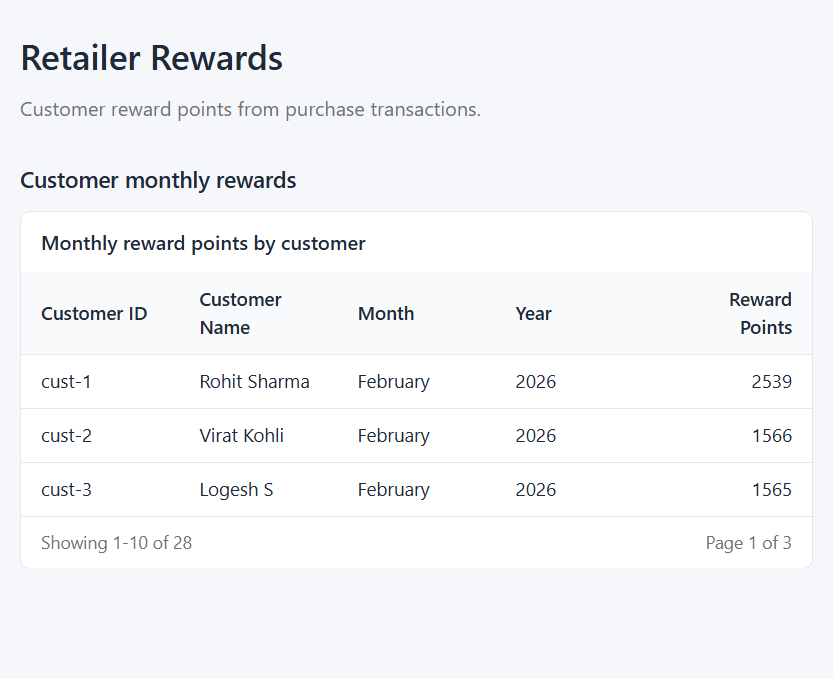
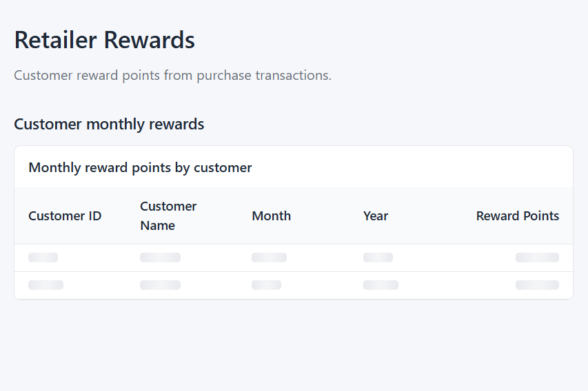
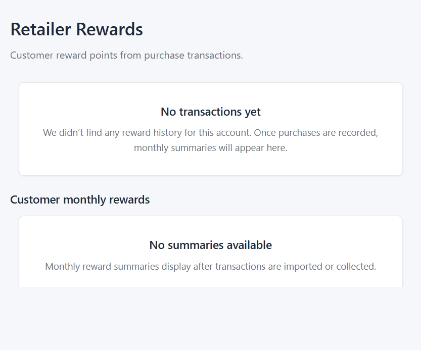
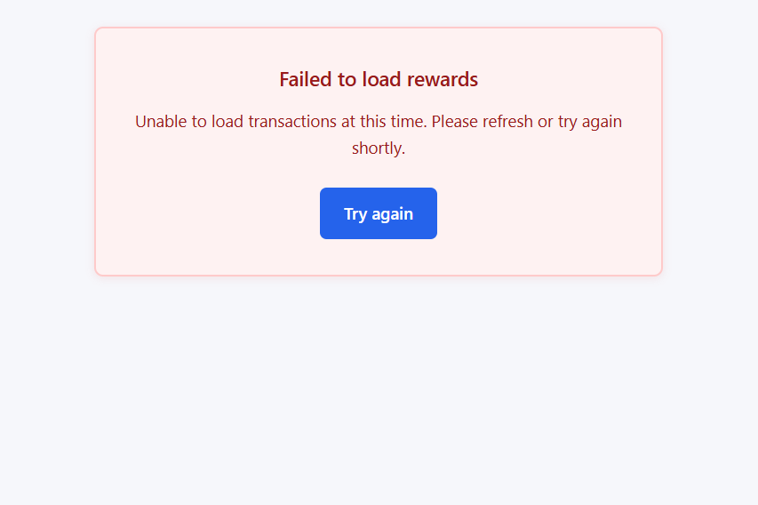

# Retailer Rewards Dashboard

A React JS rewards dashboard that calculates customer reward points from
mock retail purchase transactions. The app uses functional components,
hooks, Material React Table, and Jest tests.

## Features

- Monthly reward summaries by customer.
- Total reward points by customer.
- Paginated transaction history with calculated rewards.
- Sortable customer, date, amount, and reward columns.
- Loading skeletons, empty state, error state, and retry flow.
- Mock asynchronous API service for local development and tests.

## Reward Calculation

Reward points are calculated from the floored purchase amount:

- 1 point for every dollar over `$50` up to `$100`.
- 2 points for every dollar over `$100`.
- Invalid, non-numeric, and negative values earn `0`.
- Decimal purchases are floored before calculation.

Examples:

- `$100.2` earns `50` points.
- `$100.4` earns `50` points.
- `$120` earns `90` points.

## Directory Structure

```text
public/
  mock/              Mock transaction JSON served at runtime
src/
  components/        Shared UI components and table wrappers
  config/            Reward table column definitions
  hooks/             Data loading and dashboard state hooks
  pages/             Page-level dashboard composition
  services/          Mock async API service
  styles/            Global and dashboard CSS
  test/              Test-only wrappers
  tests/             Jest test suite
  types/             Reusable PropTypes shapes
  utils/             Reward, formatting, logging, and row helpers
docs/
  screenshots/       README state captures
```

## Screenshots

Normal flow:



Loading state:



Empty state:



Error state:



The static documentation harness at `docs/screenshot-harness.html` is
provided only for screenshot/reference work. It is not imported by the
production app.

## Assumptions And Edge Cases

- Mock data includes multiple customers, decimal purchase amounts, and a consecutive three-month transaction history.
- Monthly aggregation is keyed by customer, month, and year so the same
  month across different years remains separate.
- Invalid transaction dates are logged and skipped in monthly aggregation.
- Date display uses `Intl.DateTimeFormat` and defaults to the browser
  locale when no locale is supplied.
- Currency display uses `Intl.NumberFormat` with USD.
- Table header names intentionally do not use hover tooltips; sorting
  affordances are left to the table library.
